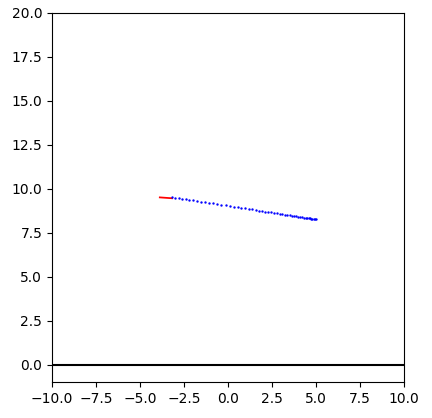

# MPC Drone Control

Implementation of a simple linear Model Predictive Controller based on the OSQP solver. The controller can be parametrized and tested using an interactive simulation.

## Execution

To run the simulation, set up a virtual environment and install the dependencies from ```requirements.txt```. The simulation can be customized in the ```parameters.yaml``` file. Typical tweaking points are the prediction horizon ```N```, the cost function matrices ```Qx```and ```Qu```, the system constraints as well as the mechanical properties of the drone.

## Simulation Model

The exemplary system is a two-dimensional simulation of a quadcopter. The inputs are the thrust force on each side. The simulated model itself is nonlinear, but for control purposes a linearized state-space representation is generated in the beginning of the simulation.

## Interactive Testing

On running the simulation ```main.py```, a live plot is opened that displays the real-time drone behaviour. By clicking into the plot area, the user can alter the drone's setpoint. The drone will transition to the newly set position by following a live-generated trajectory that accounts for acceleration and deceleration behaviour. The reference path over the prediction horizon is visualized by blue dots.


